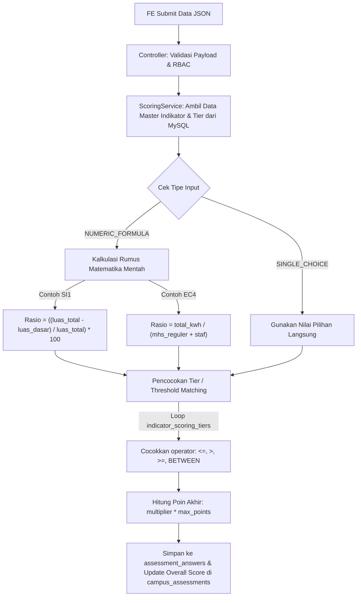

# System Design Document (SDD)
## Sistem Web Self-Assessment UI GreenMetric

Dokumen Perancangan Sistem ini dirancang sebagai acuan teknis dalam pengembangan **Sistem Web Self-Assessment UI GreenMetric**.
*   **Stack Backend:** Golang (Goravel Framework), MySQL (Database Relasional)
*   **Stack Frontend:** Vue.js / Express (REST API Consumer)

---

## BAB 1: ARSITEKTUR & ALUR PENGERJAAN BACKEND (GOLANG - GORAVEL)

Bab ini menjadi panduan teknis bagi *Backend Developer* dalam merancang database MySQL, menyusun arsitektur kode menggunakan Goravel, dan mengimplementasikan *Scoring Engine* (Mesin Skoring).

### 1.1 Arsitektur Sistem Backend (Goravel MVC / Service Pattern)

Goravel mengadopsi struktur yang sangat terorganisir. Untuk memisahkan antara logika *routing*, komunikasi database, dan algoritma skoring, backend akan dibangun dengan pola **Controller-Service-Repository (ORM)**:

*   **Routes** (`app/http/routes/api.go`): Mendefinisikan endpoint REST API, mengelompokkannya (*grouping*), serta menyematkan middleware autentikasi (JWT) dan *Role-Based Access Control* (RBAC).
*   **Controllers** (`app/http/controllers`): Menerima HTTP Request dari Frontend, melakukan validasi input (*Form Validation*), memanggil *Service Layer*, dan mengembalikan HTTP Response dalam format standar JSON.
*   **Services** (`app/services`): Tempat menyimpan seluruh *Business Logic*. Di sinilah `ScoringService` berada untuk menghitung persentase, membandingkan tier, dan menentukan poin tanpa membebani controller.
*   **Models** (`app/models`): Pemetaan tabel MySQL menggunakan ORM bawaan Goravel (berbasis GORM) untuk manipulasi data (CRUD).

---

### 1.2 Skema Database MySQL (Relational Schema)

Berikut adalah rancangan tabel utama (DDL konsep) yang perlu disiapkan pada database MySQL:

```sql
-- 1. Tabel Kampus (Member)
CREATE TABLE campuses (
    id BIGINT UNSIGNED AUTO_INCREMENT PRIMARY KEY,
    code VARCHAR(50) UNIQUE NOT NULL,
    name VARCHAR(255) NOT NULL,
    institution_type VARCHAR(100),
    climate VARCHAR(100),
    setting VARCHAR(100),
    created_at TIMESTAMP NULL,
    updated_at TIMESTAMP NULL
);

-- 2. Tabel Pengguna & RBAC
CREATE TABLE users (
    id BIGINT UNSIGNED AUTO_INCREMENT PRIMARY KEY,
    campus_id BIGINT UNSIGNED NOT NULL,
    name VARCHAR(255) NOT NULL,
    email VARCHAR(255) UNIQUE NOT NULL,
    password VARCHAR(255) NOT NULL,
    role ENUM('SUPER_ADMIN', 'ADMIN_KAMPUS', 'OPERATOR_SI', 'OPERATOR_EC', 'OPERATOR_WS', 'OPERATOR_WR', 'OPERATOR_TR', 'OPERATOR_ED', 'OPERATOR_GD') NOT NULL,
    created_at TIMESTAMP NULL,
    updated_at TIMESTAMP NULL,
    FOREIGN KEY (campus_id) REFERENCES campuses(id) ON DELETE CASCADE
);

-- 3. Tabel Master Kategori
CREATE TABLE categories (
    id BIGINT UNSIGNED AUTO_INCREMENT PRIMARY KEY,
    code VARCHAR(10) UNIQUE NOT NULL, -- SI, EC, WS, WR, TR, ED, GD
    name VARCHAR(255) NOT NULL,
    max_points INT NOT NULL,
    weight_percentage DECIMAL(5,2) NOT NULL
);

-- 4. Tabel Master Indikator
CREATE TABLE indicators (
    id BIGINT UNSIGNED AUTO_INCREMENT PRIMARY KEY,
    category_id BIGINT UNSIGNED NOT NULL,
    code VARCHAR(20) UNIQUE NOT NULL, -- SI1, SI2, EC1, dst.
    title VARCHAR(255) NOT NULL,
    input_type ENUM('NUMERIC_FORMULA', 'SINGLE_CHOICE') NOT NULL,
    max_points INT NOT NULL,
    FOREIGN KEY (category_id) REFERENCES categories(id) ON DELETE CASCADE
);

-- 5. Tabel Logika Tier Skor Indikator (Rules)
CREATE TABLE indicator_scoring_tiers (
    id BIGINT UNSIGNED AUTO_INCREMENT PRIMARY KEY,
    indicator_id BIGINT UNSIGNED NOT NULL,
    option_label VARCHAR(255) NOT NULL, -- Contoh: "> 80% - 90%"
    min_value DECIMAL(15,4) NULL,
    max_value DECIMAL(15,4) NULL,
    operator ENUM('<=', '>', '>=', 'BETWEEN', 'CHOICE') NOT NULL,
    point_multiplier DECIMAL(5,2) NOT NULL, -- 0.05, 0.25, 0.50, 0.75, 1.00
    FOREIGN KEY (indicator_id) REFERENCES indicators(id) ON DELETE CASCADE
);

-- 6. Tabel Header Assessment Kampus
CREATE TABLE campus_assessments (
    id BIGINT UNSIGNED AUTO_INCREMENT PRIMARY KEY,
    campus_id BIGINT UNSIGNED NOT NULL,
    assessment_year INT NOT NULL,
    overall_score DECIMAL(10,2) DEFAULT 0,
    status ENUM('DRAFT', 'SUBMITTED', 'VERIFIED') DEFAULT 'DRAFT',
    created_at TIMESTAMP NULL,
    updated_at TIMESTAMP NULL,
    FOREIGN KEY (campus_id) REFERENCES campuses(id) ON DELETE CASCADE
);

-- 7. Tabel Jawaban Assessment (Detail)
CREATE TABLE assessment_answers (
    id BIGINT UNSIGNED AUTO_INCREMENT PRIMARY KEY,
    campus_assessment_id BIGINT UNSIGNED NOT NULL,
    indicator_id BIGINT UNSIGNED NOT NULL,
    raw_input_data JSON NULL, -- Menyimpan input mentah, misal: {"luas_total": 100000, "luas_dasar": 15000}
    calculated_value DECIMAL(15,4) NULL, -- Hasil persentase/rasio
    selected_tier_id BIGINT UNSIGNED NULL,
    earned_points DECIMAL(10,2) DEFAULT 0,
    updated_at TIMESTAMP NULL,
    FOREIGN KEY (campus_assessment_id) REFERENCES campus_assessments(id) ON DELETE CASCADE,
    FOREIGN KEY (indicator_id) REFERENCES indicators(id) ON DELETE CASCADE
);

-- 8. Tabel Bukti Pendukung Dinamis (Repeater Evidences)
CREATE TABLE assessment_evidences (
    id BIGINT UNSIGNED AUTO_INCREMENT PRIMARY KEY,
    assessment_answer_id BIGINT UNSIGNED NOT NULL,
    document_name VARCHAR(255) NOT NULL,
    description TEXT,
    file_url VARCHAR(500) NOT NULL,
    created_at TIMESTAMP NULL,
    FOREIGN KEY (assessment_answer_id) REFERENCES assessment_answers(id) ON DELETE CASCADE
);
```

---

### 1.3 Tahapan Alur Pengerjaan Backend (Roadmap Pengerjaan)

Pengerjaan Backend dibagi ke dalam 4 fase utama agar terstruktur dan mudah diuji secara bertahap:

*   **Fase 1: Setup Framework & Autentikasi (RBAC)**
    *   Inisialisasi project Goravel dan konfigurasi koneksi database MySQL.
    *   Implementasi migrasi (*migration*) dan seeder untuk akun default, tabel `categories`, `indicators`, dan `indicator_scoring_tiers`.
    *   Implementasi JWT Authentication (Login, Logout, Token Refresh).
    *   Pembuatan Middleware RBAC: Mencegah Operator SI mengakses endpoint untuk kategori EC atau kategori lainnya.
*   **Fase 2: Modul Master Data & Dashboard**
    *   Membuat CRUD API untuk mengelola data kampus & user internal kampus.
    *   Membuat API Dashboard: Menghitung total skor (`overall_score`) dari perolehan poin seluruh kategori untuk tahun berjalan.
    *   Membuat API Tren Analisis: Mengambil riwayat skor total kampus dari tahun-tahun sebelumnya (`assessment_year`) dan menyajikannya dalam format array untuk dirender menjadi grafik oleh Frontend (FE).
*   **Fase 3: Modul Core "Scoring Engine" (Mesin Kalkulasi)**
    *   Membuat `ScoringService` di dalam project Goravel.
    *   Mengolah request input dari FE $\rightarrow$ Mengeksekusi rumus hitungan matematika mentah $\rightarrow$ Mencocokkan nilai hasil dengan tabel `indicator_scoring_tiers` $\rightarrow$ Menghitung poin ($\text{multiplier} \times \text{max\_points}$).
    *   Menyimpan hasil ke tabel `assessment_answers` dan melakukan auto-update pada kolom `overall_score` di tabel `campus_assessments`.
*   **Fase 4: Modul File Uploader Dinamis & Finalisasi**
    *   Membuat endpoint upload file ke penyimpanan lokal/cloud (AWS S3 atau Goravel Local Storage) dengan validasi format (`.pdf`, `.jpg`, `.png`) maksimal 2 MB.
    *   Menghubungkan url path file yang ter-upload ke tabel `assessment_evidences`.
    *   Membuat endpoint Submit Assessment untuk mengunci data (`status = 'SUBMITTED'`).

---

### 1.4 Desain Mesin Skoring (Scoring Engine Service)

Pada level coding di Goravel (`app/services/scoring_service.go`), logika skoring bekerja dengan urutan alur algoritma berikut:



---

## BAB 2: SPESIFIKASI API & KONTRAK DATA (UNTUK FRONTEND)

Bab ini adalah Kontrak Kerja API antara Anda (BE) dan rekan Anda (FE). Tim FE cukup mengikuti struktur URL, Request Body, dan Response JSON di bawah ini untuk mengintegrasikan antarmuka web (Vue/Express).

### 2.1 Standar Komunikasi API
*   **Base URL:** `http://domain-server.com/api/v1`
*   **Content-Type:** `application/json` (Kecuali untuk upload file menggunakan `multipart/form-data`).
*   **Autentikasi:** Menggunakan Bearer Token JWT. Setiap request ke endpoint yang diproteksi wajib menyertakan header:
    ```http
    Authorization: Bearer <token_jwt_di_sini>
    ```

---

### 2.2 Modul Autentikasi (Auth)

#### A. Login Pengguna
*   **Endpoint:** `POST /auth/login`
*   **Akses:** Publik
*   **Request Body (JSON):**
    ```json
    {
      "email": "admin@polinema.ac.id",
      "password": "secretpassword"
    }
    ```
*   **Response Success (200 OK):**
    ```json
    {
      "status": "success",
      "message": "Login berhasil",
      "data": {
        "token": "eyJhbGciOiJIUzI1NiIsInR5cCI6IkpXVCJ9...",
        "user": {
          "id": 2,
          "name": "Syarif Admin Green Campus",
          "email": "admin@polinema.ac.id",
          "role": "ADMIN_KAMPUS",
          "campus": {
            "id": 1,
            "code": "POLINEMA-KDR",
            "name": "Politeknik Negeri Malang - PSDKU Kediri"
          }
        }
      }
    }
    ```

---

### 2.3 Modul Dashboard & Analisis Tren

#### A. Ambil Data Summary & Tren Skor Kampus
*   **Endpoint:** `GET /assessments/dashboard`
*   **Akses:** Semua Role Internal Kampus (Admin Kampus & Operator Kategori)
*   **Response Success (200 OK):**
    ```json
    {
      "status": "success",
      "data": {
        "campus_name": "Politeknik Negeri Malang - PSDKU Kediri",
        "current_year": 2026,
        "assessment_status": "DRAFT",
        "overall_score": 6450.50,
        "max_overall_score": 10000.00,
        "estimated_rank": 42,
        "category_breakdown": [
          { "code": "SI", "name": "Setting and Infrastructure", "earned": 850.00, "max": 1100.00 },
          { "code": "EC", "name": "Energy and Climate Change", "earned": 1400.00, "max": 2000.00 },
          { "code": "WS", "name": "Waste", "earned": 1200.00, "max": 1700.00 },
          { "code": "WR", "name": "Water", "earned": 750.00, "max": 1100.00 },
          { "code": "TR", "name": "Transportation", "earned": 1100.00, "max": 1700.00 },
          { "code": "ED", "name": "Education and Research", "earned": 650.50, "max": 1300.00 },
          { "code": "GD", "name": "Governance and Digitalization", "earned": 500.00, "max": 1100.00 }
        ],
        "trend_history": [
          { "year": 2024, "score": 5100.00 },
          { "year": 2025, "score": 5850.00 },
          { "year": 2026, "score": 6450.50 }
        ]
      }
    }
    ```
> [!TIP]
> **Catatan untuk FE:** Gunakan array `trend_history` untuk merender grafik garis (*Line Chart*) di dasbor.

---

### 2.4 Modul Form Assessment & Skoring Otomatis

#### A. Ambil Form Soal Per Kategori
*   **Endpoint:** `GET /categories/{category_code}/indicators`
    *   *Contoh URL:* `GET /categories/SI/indicators`
*   **Akses:** Admin Kampus & Operator Kategori Yang Bersangkutan (Misal: `OPERATOR_SI`)
*   **Response Success (200 OK):**
    ```json
    {
      "status": "success",
      "data": {
        "category_code": "SI",
        "category_name": "Setting and Infrastructure",
        "total_category_points_earned": 100.00,
        "indicators": [
          {
            "indicator_id": 1,
            "code": "SI1",
            "title": "Rasio luas ruang terbuka terhadap total luas",
            "input_type": "NUMERIC_FORMULA",
            "max_points": 200,
            "required_fields": [
              { "key": "luas_total", "label": "Total Luas Kampus (m2)", "unit": "m2" },
              { "key": "luas_dasar", "label": "Total Luas Lantai Dasar Bangunan (m2)", "unit": "m2" }
            ],
            "current_answer": {
              "raw_input_data": { "luas_total": 100000, "luas_dasar": 15000 },
              "calculated_value": 85.00,
              "earned_points": 100.00,
              "evidences": [
                {
                  "id": 101,
                  "document_name": "Peta Ruang Terbuka Kampus",
                  "description": "Area hijau mencakup 85% dari total lahan",
                  "file_url": "http://domain-server.com/storage/evidences/peta_2026.pdf"
                }
              ]
            }
          }
        ]
      }
    }
    ```

#### B. Simpan Jawaban & Eksekusi Skoring Otomatis
*   **Endpoint:** `POST /assessments/answers`
*   **Akses:** Admin Kampus & Operator Kategori Terkait
*   **Request Body (JSON):**
    ```json
    {
      "indicator_code": "SI1",
      "assessment_year": 2026,
      "raw_input_data": {
        "luas_total": 100000,
        "luas_dasar": 15000
      }
    }
    ```
*   **Response Success (200 OK) - Hasil langsung dihitung oleh BE:**
    ```json
    {
      "status": "success",
      "message": "Jawaban SI1 berhasil disimpan dan dihitung",
      "data": {
        "indicator_code": "SI1",
        "calculated_value": 85.00,
        "selected_tier_label": "> 80% - 90%",
        "earned_points": 100.00,
        "new_overall_score": 6450.50
      }
    }
    ```

---

### 2.5 Modul Upload Bukti Dinamis (Repeater Evidences)

Karena dokumen bukti bersifat dinamis (bisa banyak file per indikator), FE akan memanggil API ini setiap kali operator mengunggah 1 file pada indikator tertentu.

#### A. Upload Dokumen Bukti
*   **Endpoint:** `POST /evidences/upload`
*   **Content-Type:** `multipart/form-data`
*   **Akses:** Admin Kampus & Operator Terkait
*   **Payload Form-Data:**
    *   `indicator_code`: `"SI1"`
    *   `assessment_year`: `"2026"`
    *   `document_name`: `"SK Tim Green Campus"`
    *   `description`: `"Surat keputusan rektor untuk pengelola lahan"`
    *   `file`: *(Binary File PDF/JPG/PNG max 2MB)*
*   **Response Success (201 Created):**
    ```json
    {
      "status": "success",
      "message": "Dokumen bukti berhasil diunggah",
      "data": {
        "evidence_id": 102,
        "document_name": "SK Tim Green Campus",
        "file_url": "http://domain-server.com/storage/evidences/sk_green_2026.pdf"
      }
    }
    ```

#### B. Hapus Dokumen Bukti
*   **Endpoint:** `DELETE /evidences/{evidence_id}`
    *   *Contoh URL:* `DELETE /evidences/102`
*   **Response Success (200 OK):**
    ```json
    {
      "status": "success",
      "message": "Dokumen bukti berhasil dihapus"
    }
    ```

---

### 2.6 Modul Finalisasi Assessment

Ketika semua kategori selesai diisi, Admin Kampus mengunci data agar tidak dapat diubah lagi oleh operator.

*   **Endpoint:** `POST /assessments/submit`
*   **Akses:** Khusus `ADMIN_KAMPUS`
*   **Request Body (JSON):**
    ```json
    {
      "assessment_year": 2026
    }
    ```
*   **Response Success (200 OK):**
    ```json
    {
      "status": "success",
      "message": "Data evaluasi UI GreenMetric 2026 berhasil disubmit. Data telah dikunci.",
      "data": {
        "status": "SUBMITTED",
        "final_overall_score": 6450.50,
        "submitted_at": "2026-06-15T14:30:00Z"
      }
    }
    ```

---

### 2.7 Standar Kode Error JSON (Error Handling untuk FE)

Jika terjadi kesalahan pada sistem, validasi, atau pembatasan hak akses, Backend (Goravel) tidak akan mengembalikan halaman HTML kosong atau stack trace error mentah, melainkan mengembalikan format JSON standar. Berikut adalah 5 skenario error yang wajib ditangani oleh UI/UX Frontend:

#### A. Error Validasi Input Form (422 Unprocessable Entity)
Terjadi ketika operator memasukkan angka yang tidak masuk akal (misal: luas lantai dasar melebihi luas total kampus) atau mengunggah file yang melebihi batas ukuran/salah format.
```json
{
  "status": "error",
  "code": 422,
  "message": "Validasi data gagal",
  "errors": {
    "luas_dasar": ["Total luas lantai dasar tidak boleh lebih besar dari total luas kampus"],
    "file": ["Ukuran file tidak boleh melebihi 2048 KB", "Format file wajib .pdf, .jpg, atau .png"]
  }
}
```
> [!IMPORTANT]
> **Tindakan Frontend (FE):** Tangkap array `errors` dan tampilkan pesan berwarna merah tepat di bawah kolom input form masing-masing yang bermasalah.

#### B. Error Hak Akses Role / RBAC (403 Forbidden)
Terjadi ketika akun yang sedang login mencoba mengakses atau menyunting menu indikator yang bukan kewenangannya (misalnya: Operator SI mencoba mengirim jawaban untuk form indikator EC).
```json
{
  "status": "error",
  "code": 403,
  "message": "Akses ditolak. Role OPERATOR_SI tidak diizinkan mengubah data pada kategori Energy and Climate Change (EC)."
}
```
> [!IMPORTANT]
> **Tindakan Frontend (FE):** Tampilkan alert atau toast notification peringatan hak akses, lalu redirect pengguna kembali ke menu kategori aslinya.

#### C. Error Autentikasi / Token Kedaluwarsa (401 Unauthorized)
Terjadi ketika pengguna mencoba mengakses endpoint dasbor tetapi belum login, atau token JWT yang dikirimkan di header sudah kedaluwarsa (*expired*).
```json
{
  "status": "error",
  "code": 401,
  "message": "Token autentikasi tidak valid atau sudah kedaluwarsa. Silakan login kembali."
}
```
> [!IMPORTANT]
> **Tindakan Frontend (FE):** Hapus sesi/token yang tersimpan di Local Storage, lalu secara otomatis redirect pengguna ke halaman Login.

#### D. Error Data Tidak Ditemukan (404 Not Found)
Terjadi jika Frontend meminta atau mencoba menghapus data dengan ID yang tidak ada di dalam database MySQL (misal: menghapus dokumen bukti dengan ID yang sudah dihapus sebelumnya).
```json
{
  "status": "error",
  "code": 404,
  "message": "Dokumen bukti dengan ID 102 tidak ditemukan atau sudah dihapus."
}
```
> [!IMPORTANT]
> **Tindakan Frontend (FE):** Tampilkan notifikasi kecil bahwa data tidak ditemukan, lalu lakukan refresh/fetch ulang pada tabel dokumen bukti.

#### E. Error Internal Server / Database (500 Internal Server Error)
Terjadi jika ada kendala teknis di sisi Backend, seperti koneksi database MySQL terputus atau terjadi kesalahan kalkulasi pada *Scoring Engine* yang tidak terduga.
```json
{
  "status": "error",
  "code": 500,
  "message": "Terjadi kesalahan internal pada server. Silakan hubungi administrator web UI GreenMetric."
}
```
> [!IMPORTANT]
> **Tindakan Frontend (FE):** Tampilkan pesan error umum yang ramah pengguna (misal: *"Mohon maaf, server sedang sibuk atau mengalami gangguan"*), tanpa menampilkan log teknis database ke layar user.
