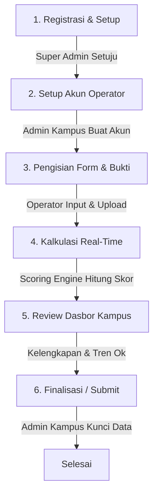

# Software Requirements Specification (SRS)
## Sistem Web Self-Assessment UI GreenMetric

Dokumen ini menjelaskan spesifikasi kebutuhan perangkat lunak untuk **Sistem Web Self-Assessment UI GreenMetric**. Sistem ini dirancang untuk memudahkan perguruan tinggi dalam melakukan penilaian mandiri (self-assessment) kinerja keberlanjutan lingkungan berdasarkan indikator-indikator standar UI GreenMetric.

---

## 1. Arsitektur & Spesifikasi Modul Utama

Sistem ini dibagi menjadi dua ranah utama: **Frontend (Publik/Landing Page)** dan **Backend (CMS Admin & Dashboard Assessment Kampus)**.

### A. Modul Publik (Landing Page)
Modul ini dapat diakses oleh publik tanpa memerlukan proses login. Fitur utama mencakup:
*   **Home:** Menampilkan banner grafis bertema UI GreenMetric, tagline kampus berkelanjutan, dan pengantar ringkas sistem.
*   **Tentang Web & Fitur:** Penjelasan detail mengenai apa itu UI GreenMetric, tujuan sistem *self-assessment*, serta manfaat partisipasi bagi institusi.
*   **News & Kampus Member:**
    *   Area publikasi berita atau artikel mengenai kegiatan keberlanjutan kampus.
    *   Direktori/daftar kampus anggota (*Member Campuses*) yang telah terdaftar di dalam sistem.
*   **Statistik Publik:** Visualisasi infografis mengenai jumlah kampus terdaftar, statistik akses web, atau agregasi tren lingkungan secara umum.
*   **Kontak & Footer:** Formulir kontak, informasi kontak admin pengelola web, tautan media sosial, serta kebijakan privasi.

### B. Modul Dashboard & CMS Assessment (Berbasis Akun)
Modul ini dilindungi hak akses dan memerlukan login. Fitur utama mencakup:
*   **Dashboard Utama (Overall Score & Analisis Tren):**
    *   **Overall Score:** Menampilkan total skor kampus untuk tahun berjalan (maksimal 10.000 poin).
    *   **Grafik Tren Tahunan:** Komparasi visual (grafik garis/batang) mengenai pergerakan skor dari tahun ke tahun untuk memantau perkembangan kinerja kampus.
    *   **Perkiraan Peringkat (Rank Estimation):** Membandingkan skor total yang diperoleh dengan database benchmark atau nilai ambang batas tahun-tahun sebelumnya untuk memprediksi posisi peringkat kampus.
*   **Navigasi 7 Kategori Indikator:** Menu terdedikasi untuk masing-masing kategori penilaian:
    1.  **SI (Setting and Infrastructure)** – Bobot 11% (Maks 1.100 poin)
    2.  **EC (Energy and Climate Change)** – Bobot 20% (Maks 2.000 poin)
    3.  **WS (Waste)** – Bobot 17% (Maks 1.700 poin)
    4.  **WR (Water)** – Bobot 11% (Maks 1.100 poin)
    5.  **TR (Transportation)** – Bobot 17% (Maks 1.700 poin)
    6.  **ED (Education and Research)** – Bobot 13% (Maks 1.300 poin)
    7.  **GD (Governance and Digitalization)** – Bobot 11% (Maks 1.100 poin)

---

## 2. Manajemen Pengguna & Multi-Role (RBAC)

Sistem menggunakan konsep **Role-Based Access Control (RBAC)** untuk mengakomodasi alur pendelegasian tugas di internal kampus secara terstruktur.

| Role | Batasan Akses & Kewenangan |
| :--- | :--- |
| **Super Admin (CMS Admin)** | Mengelola sistem secara keseluruhan, menyetujui pendaftaran akun kampus baru, mengelola artikel/berita, serta memantau data seluruh kampus yang terdaftar. |
| **Admin Kampus** *(1 Akun per Kampus)* | Memiliki kendali penuh atas dasbor kampusnya sendiri. Bertugas membuat, mengelola, dan mendistribusikan akun kepada operator penanggung jawab kategori, serta memantau *Overall Score* dan grafik tren. |
| **Operator Kategori** *(7 Role per Kampus)* | Akun khusus yang ditugaskan untuk mengisi dan mengelola indikator spesifik sesuai keahliannya (misal: *Operator SI*, *Operator EC*, hingga *Operator GD*). Akun ini hanya dapat melihat dan menyunting form pada menu kategori yang ditugaskan kepadanya. |

> [!NOTE]
> **Catatan Alur:** Dengan struktur ini, dalam 1 kampus minimal akan terdapat **8 akun aktif** (1 Admin Kampus + 7 Operator Kategori) yang bekerja secara kolaboratif mengisi form *self-assessment*.

---

## 3. Logika Mesin Perhitungan Skor Otomatis (Scoring Engine)

Inti dari sistem ini adalah mesin kalkulasi dinamis yang mengubah input numerik atau pilihan ganda dari pengguna menjadi skor persentase/poin secara *real-time* tanpa perlu perhitungan manual.

### A. Alur Kerja Logika Skoring
1.  **Input Numerik Mentah (Raw Data Input):** Pengguna memasukkan angka dasar yang diminta pada form (misalnya: total luas kampus, luas lantai dasar, populasi mahasiswa, atau konsumsi listrik).
2.  **Kalkulasi Rumus Otomatis (Automated Formula Execution):** Sistem mengeksekusi rumus sesuai ketetapan UI GreenMetric untuk mencari nilai persentase (%) atau rasio per orang.
3.  **Penentuan Tier Skor (Threshold Matching):** Hasil kalkulasi dicocokkan dengan tabel interval (biasanya opsi 1 sampai 5) untuk menentukan bobot desimal (mulai dari `0.05`, `0.25`, `0.50`, `0.75`, hingga `1.00`).
4.  **Perhitungan Poin Akhir (Final Point Calculation):** Bobot desimal dikalikan dengan poin maksimal pada indikator tersebut untuk menghasilkan skor otomatis yang langsung diakumulasikan ke *Overall Score*.

---

### B. Simulasi Implementasi Logika (Contoh Kasus Nyata)

#### **Kasus 1: Indikator SI1 (Rasio Luas Ruang Terbuka terhadap Luas Total - Maks 200 Poin)**

*   **Form Input User:**
    *   Total luas kampus ($m^2$): `100.000`
    *   Total luas lantai dasar bangunan kampus ($m^2$): `15.000`
*   **Proses Eksekusi Logika Sistem:**
    *   **Langkah 1 (Rumus):**
        $$\text{Persentase (\%)} = \frac{\text{luas\_total} - \text{luas\_dasar}}{\text{luas\_total}} \times 100\%$$
        $$\text{Persentase (\%)} = \frac{100.000 - 15.000}{100.000} \times 100\% = 85\%$$
    *   **Langkah 2 (Pencocokan Opsi Tier):**
        *   $\le 1\%$ $\rightarrow$ bobot `0.05`
        *   $> 1\% - 80\%$ $\rightarrow$ bobot `0.25`
        *   **$> 80\% - 90\%$ $\rightarrow$ bobot `0.50` (Sistem masuk ke tier ini karena hasil 85%)**
        *   $> 90\% - 95\%$ $\rightarrow$ bobot `0.75`
        *   $> 95\%$ $\rightarrow$ bobot `1.00`
    *   **Langkah 3 (Kalkulasi Skor Akhir SI1):**
        $$\text{Skor SI1} = 0.50 \times 200\text{ poin} = 100\text{ Poin}$$
        *Sistem secara otomatis mengunci angka **100 poin** pada dasbor untuk indikator SI1.*

---

#### **Kasus 2: Indikator EC4 (Total Penggunaan Listrik Dibagi Populasi Kampus - Maks 200 Poin)**

*   **Form Input User:**
    *   Total penggunaan listrik per tahun (kWh): `3.000.000`
    *   Total mahasiswa reguler: `5.000`
    *   Total staf akademik & administrasi: `1.000`
*   **Proses Eksekusi Logika Sistem:**
    *   **Langkah 1 (Rumus):**
        $$\text{kWh per orang} = \frac{\text{total\_kwh}}{\text{mhs\_reguler} + \text{staf}}$$
        $$\text{kWh per orang} = \frac{3.000.000}{5.000 + 1.000} = 500\text{ kWh/orang}$$
    *   **Langkah 2 (Pencocokan Opsi Tier):**
        *   $\ge 2.400\text{ kWh}$ $\rightarrow$ bobot `0.05`
        *   $> 1.500 - 2.400\text{ kWh}$ $\rightarrow$ bobot `0.25`
        *   $> 600 - 1.500\text{ kWh}$ $\rightarrow$ bobot `0.50`
        *   **$\ge 250 - 600\text{ kWh}$ $\rightarrow$ bobot `0.75` (Sistem masuk ke tier ini karena hasil 500 kWh)**
        *   $< 250\text{ kWh}$ $\rightarrow$ bobot `1.00`
    *   **Langkah 3 (Kalkulasi Skor Akhir EC4):**
        $$\text{Skor EC4} = 0.75 \times 200\text{ poin} = 150\text{ Poin}$$
        *Sistem secara otomatis mengunci angka **150 poin** pada dasbor untuk indikator EC4.*

---

## 4. Desain Fitur Khusus: Upload Bukti Dinamis (Custom Document Uploader)

Karena setiap kampus memiliki jumlah gedung, fasilitas, atau dokumen bukti (*evidence*) yang berbeda-beda, form unggah file didesain dinamis menggunakan pendekatan **Repeater Form** (bukan input statis tunggal).

*   **Tombol "+ Tambah Dokumen Bukti":** Memungkinkan pengguna menambahkan baris lampiran baru secara tak terbatas sesuai kebutuhan.
*   **Form Input Per Baris Lampiran:**
    *   **Nama Dokumen** *(Text Input)*: Penamaan dokumen secara spesifik (misal: `"SK Tim Green Campus 2026"` atau `"Peta Area Resapan Air Kampus A"`).
    *   **Keterangan / Kuantitatif** *(Textarea)*: Deskripsi pendukung atau angka kuantitatif yang dipersyaratkan oleh pedoman.
    *   **File Upload** *(File Input)*: Unggah file dalam format `.pdf`, `.jpg`, atau `.png` dengan batasan ukuran maksimal (misal: `2 MB` per file) atau berupa tautan/URL publik.

---

## 5. Rekomendasi Skema Database (Relational Model)

Untuk mendukung sistem evaluasi yang dapat melacak sejarah skor secara tahunan (*annual history*), struktur tabel database disarankan disusun seperti berikut:

| Nama Tabel | Deskripsi |
| :--- | :--- |
| **`campuses`** | Menyimpan data identitas kampus (Nama, Kode, Negara, Iklim, Jenis Institusi). |
| **`users`** | Menyimpan kredensial login, relasi `campus_id`, serta `role_id` (Admin Kampus, Operator SI, Operator EC, dll.). |
| **`assessment_years`** | Menyimpan periode tahun penilaian (misal: `2025`, `2026`, dst.). |
| **`categories`** | Menyimpan 7 kategori utama beserta bobot poin maksimalnya (SI = 1100, EC = 2000, dll.). |
| **`indicators`** | Menyimpan master data indikator (SI1, SI2, EC1, dst.), jenis input, rumus kalkulasi, dan poin maksimal. |
| **`indicator_scoring_tiers`** | Menyimpan aturan logika range nilai (operator `<=`, `>`, `>=`, `BETWEEN`) dan bobot pengalinya (`0.05` s.d `1.00`). |
| **`campus_assessments`** | Tabel header yang mencatat total skor kampus pada tahun tertentu (`campus_id`, `year_id`, `overall_score`, `status_submission`). |
| **`assessment_answers`** | Menyimpan jawaban numerik atau opsi yang diinput oleh user untuk setiap indikator (`assessment_id`, `indicator_id`, `raw_input_value`, `calculated_percentage`, `earned_points`). |
| **`assessment_evidences`** | Menyimpan file-file bukti yang diunggah secara dinamis (`answer_id`, `document_name`, `file_path_or_url`, `description`). |

---

## 6. Alur Kerja Sistem (Workflow Klien)

1.  **Registrasi & Setup:** Kampus mendaftar ke sistem $\rightarrow$ Super Admin menyetujui pendaftaran $\rightarrow$ Admin Kampus mendapatkan akses.
2.  **Setup Akun Operator:** Admin Kampus masuk ke sistem dan membuat 7 akun operator sesuai dengan masing-masing kategori penilaian.
3.  **Pengisian Form Assessment:** Tiap operator masuk menggunakan akun masing-masing, mengisi form input angka, dan mengunggah dokumen bukti dinamis (*evidence*).
4.  **Kalkulasi Real-Time:** Setiap kali operator menekan tombol "Simpan & Hitung", *Scoring Engine* memproses data input secara otomatis dan memperbarui poin indikator.
5.  **Review Dasbor Kampus:** Admin Kampus memantau progress pengisian, kelengkapan berkas, grafik tren tahunan, dan estimasi peringkat melalui dasbor utama.
6.  **Finalisasi / Submit:** Setelah seluruh data 7 kategori selesai diisi dan divalidasi secara internal, Admin Kampus mengunci data (*Submit Assessment*) agar tidak dapat diubah lagi.
